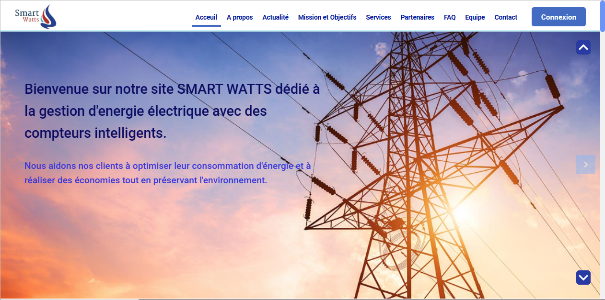
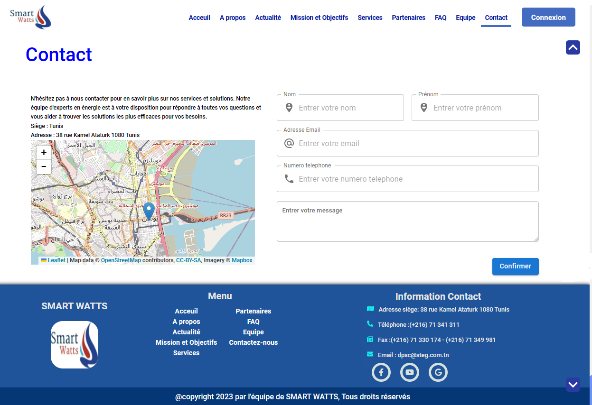
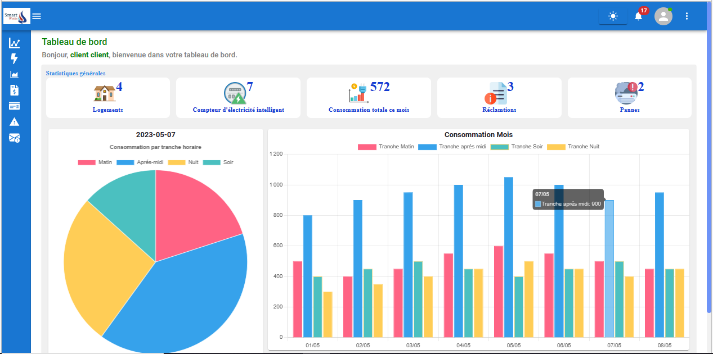
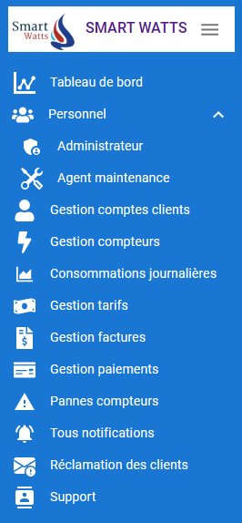
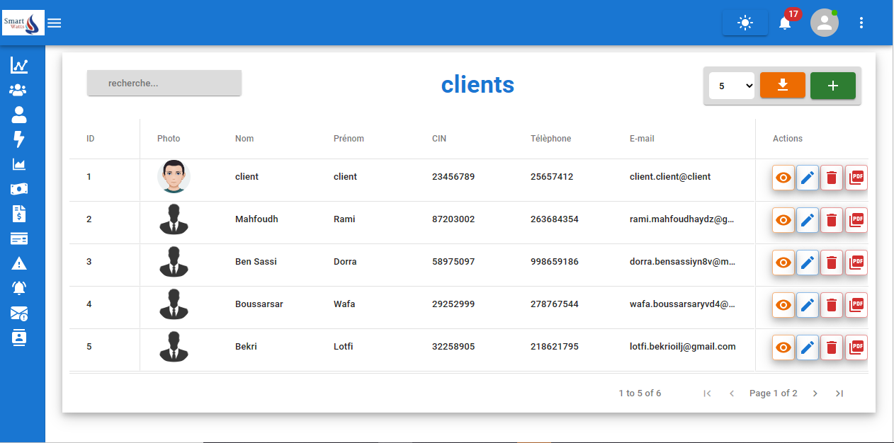
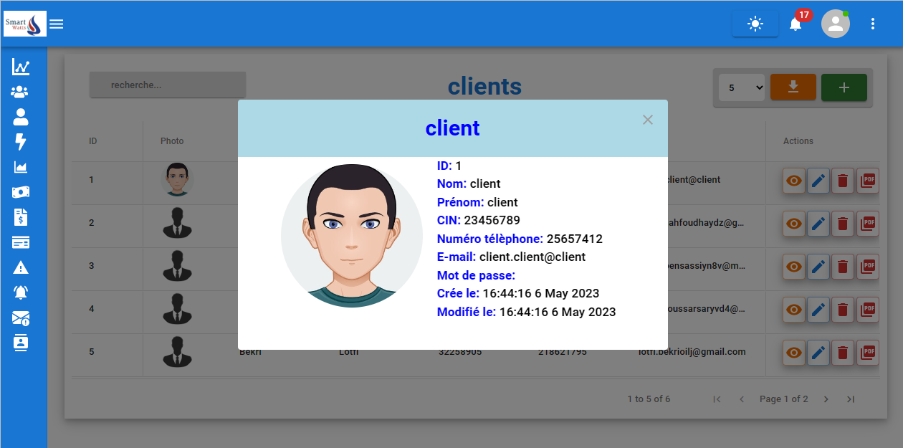
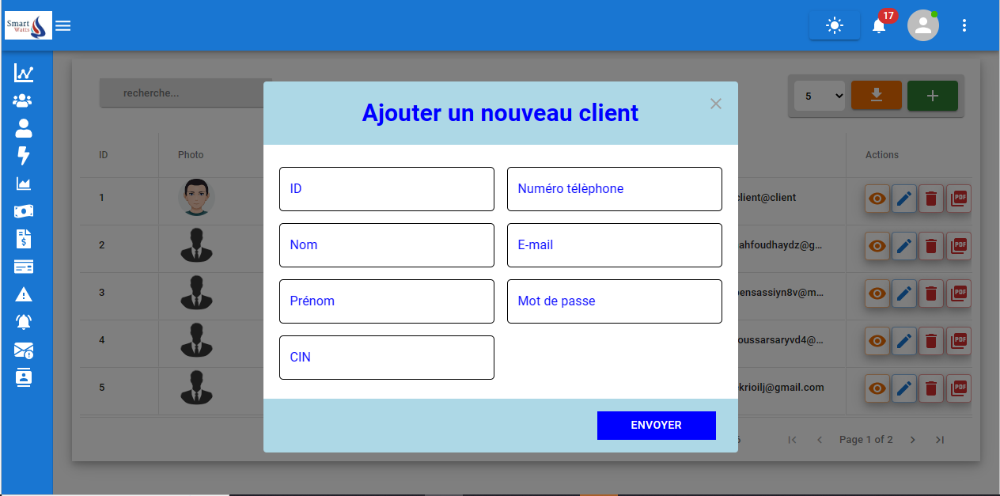
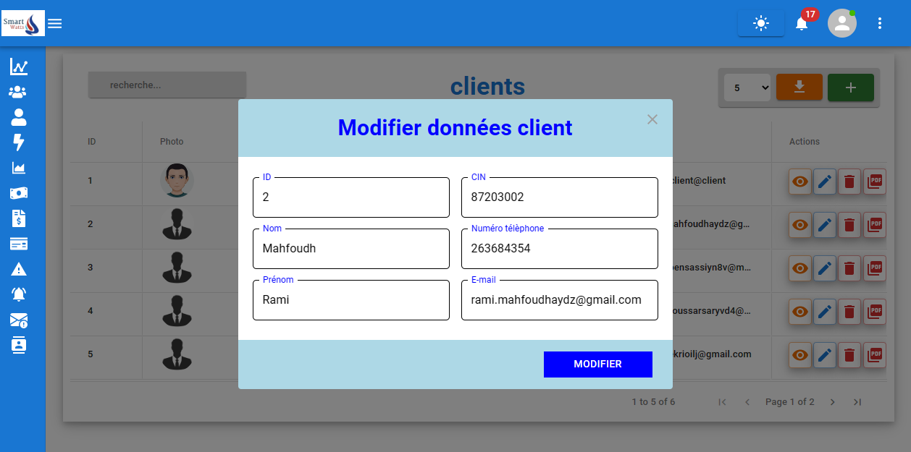
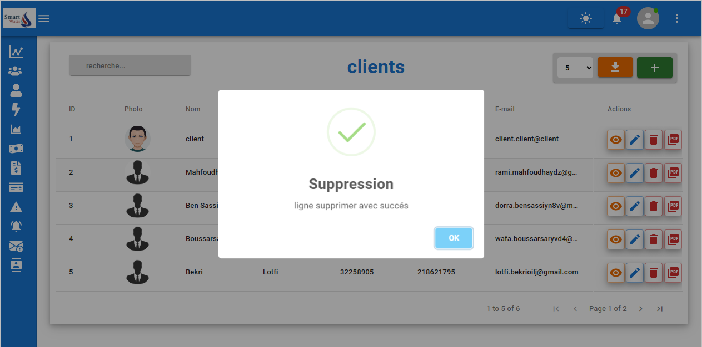

# Smart Watts

**Smart Watts** is a web application built with **React.js**, **Laravel**, and **MySQL**, designed to provide an intelligent solution for monitoring and managing energy consumption.

---

## Demo & Presentation

- 📊 **Project Presentation (Visme):** [View here](https://my.visme.co/view/dm9kovyk-smart-grid)  
- 🎥 **Web Application Demo Video:** [Watch here](https://drive.google.com/file/d/12rrVufd_LzU7gjTryhsnVHWxMKET02IC/view?usp=sharing)

hhh
<video width="600" controls>
  <source src="demo.mp4" type="video/mp4">
  Your browser does not support the video tag.
</video>
ggggggggggg
---

## Technologies Used
- **Frontend:** React.js
- **Backend:** Laravel (PHP)
- **Database:** MySQL

---

## Authentication
The application allows **clients**, **administrators**, and **maintenance agents** to securely log in.

*Page d'authentification*  

  

The **homepage** is accessible to all users, even those without an account. It contains general information about the application and a **contact form** for users to submit inquiries.

  
  

---

## Frontend Features
Users can view their energy consumption and invoices, displayed in daily and monthly charts and statistics.

*Client Dashboard Interface*  

  

---

## Back-Office / Admin Panel
After logging in, **administrators** access a navigation menu for managing various tasks.

*Admin Navigation Menu*  

  
  

Administrators can manage clients in the database: display, add, edit, and delete client records.

*Client Management Interface*  

  

*View Client Details*  

  

*Add New Client*  

  

*Edit Client*  

  

*Delete Client*  

  

---

## Team
- **Wiem Moussi**  
- **Rihab Cherni**

---

## Conclusion
Smart Watts provides a comprehensive and user-friendly platform for **tracking, managing, and analyzing energy consumption**, supporting both end-users and administrative staff efficiently.